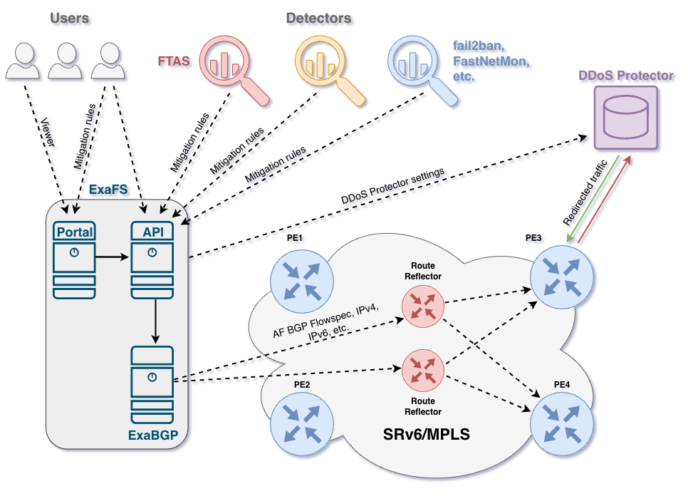
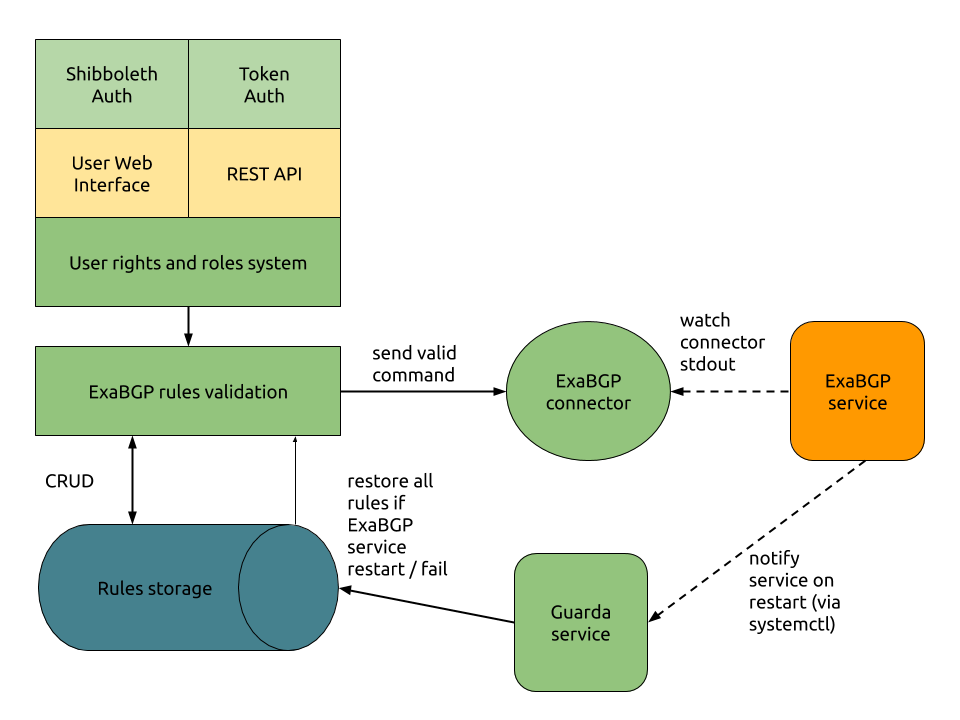

# ExaFS

ExaFS brings new functionality to the environment of routing protocols configuration for backbone network hardware security. 

The tool extends network administrators toolset by adding an extra layer for configuration rules creation, validation, and authorization. With this new layer, a larger group of network administrators can safely create new
 [BGP protocol](https://github.com/Exa-Networks/exabgp) rules to prevent DDoS and other forms of malicious cyber attacks. 

ExaFS is open source with MIT license. The system is regularly used at [CESNET](https://www.cesnet.cz/) - the Czech national e-infrastructure for science, research and education operator.

ExaFS provides both the user Web interface and the REST API for web service. 

Key contributions of the system are **user authorization** mechanism and **validation system for BGP commands**.

Without ExaFS the system Root privileges are required for direct interaction with ExaBGP and networking hardware. ExaFS provides several user roles and access rights similarly to user roles in other software systems such as SQL. The system allows specifying user rights for various kinds of sub-nets following the network topology.

Validation system for BGP commands assures that only error-free messages can pass to the system BGP API. Both syntax and access rights are validated before a new rule can be stored in the database.

Thanks to the storage, all the rules can be restored quickly after a system reboot or failure. All rules are validated again, before sending them to ExaBPG from the storage, to prevent any malicious database manipulation.

ExaFS is an integral part of cybersecurity tools at CESNET. However, it can be used in any network where ExaBGP is available.

See how is ExaFS integrated into the network in the picture below. 

## Project presentations

* 2020 - CZ [DDoS Protector v prostředí propojovacího uzlu NIX.CZ](https://www.cesnet.cz/wp-content/uploads/2020/02/DDP_v_NIX.pdf), [Seminář o bezpečností sítí a služeb 2020](https://www.cesnet.cz/akce/bss20/)
* 2019 - EN [ExaFS: mitigating unwanted traffic](https://xn--ondej-kcb.caletka.cz/dl/slidy/20191113-SIGNOC-ExaFS.pdf), [10th SIG-NOC meeting](https://wiki.geant.org/display/SIGNOC/10th+SIG-NOC+meeting), Prague
* 2019 - CZ [Potlačení nežádoucího provozu pomocí BGP Flowspec](https://indico.csnog.eu/event/6/contributions/64/attachments/35/61/CESNET-FlowSpec-CSNOG.pdf), [CSNOG 2019](https://indico.csnog.eu/event/6/overview) 
* 2019 - CZ [Nástroje pro FlowSpec a RTBH](https://konference.cesnet.cz/prezentace2019/sal1/3_Adamec.pdf), [Konference e-infrastruktury CESNET](https://konference.cesnet.cz/) 2019
* 2019 - CZ [Nástroje pro obranu proti útokům na páteřních směrovačích](https://konference.cesnet.cz/prezentace2019/sal1/3_Verich.pdf),[Konference e-infrastruktury CESNET](https://konference.cesnet.cz/) 2019

## System overview

The core component of ExaFS is a web application written in Python using the Flask framework. It provides a user interface for managing ExaBGP rules (CRUD operations) and also exposes a REST API with similar functionality. The web application uses Shibboleth for authentication, while the REST API relies on token-based authentication.

The application generates ExaBGP commands and forwards them to the ExaBGP process. All rules are thoroughly validated—only valid rules are stored in the database and sent to the ExaBGP connector.

The second component of the system is a separate application that replicates received commands to `stdout`. The connection between the ExaBGP daemon and the `stdout` of the ExaAPI (ExaBGP process) is defined in the ExaBGP configuration.

This API was originally part of the same project but has since been moved to its own repository. You can use the [exabgp-process pip package](https://pypi.org/project/exabgp-process/), clone the Git repository, or develop your own implementation.

Each time this process receives a command from ExaFS, it outputs it to `stdout`, allowing the ExaBGP service to process the command and update its routing table—creating, modifying, or removing rules accordingly.

It may also be necessary to monitor ExaBGP and re-announce rules after a restart or shutdown. This can be handled via the ExaBGP service configuration, or by using an example system service called **Guarda**, described in the documentation. In either case, the key mechanism is calling the application endpoint `/rules/announce_all`. This endpoint is only accessible from `localhost`; a local IP address must be configured in the application settings.

## DOCS
### Instalation related
* [ExaFS Ansible deploy](https://github.com/CESNET/ExaFS-deploy) - repository with Ansbile playbook for deploying ExaFS with Docker Compose. 
* [Install notes](./docs/INSTALL.md)
* [using Docker Image](./docs/DockerImage.md)
* [Database backup configuration](./docs/DB_BACKUP.md)
* [Local database instalation notes](./docs/DB_LOCAL.md)
### API
The REST API is documented using Swagger (OpenAPI). After installing and running the application, the API documentation is available locally at the /apidocs/ endpoint. This interactive documentation provides details about all available endpoints, request and response formats, and supported operations, making it easier to integrate and test the API.

## [Change log](./CHANGELOG.md)